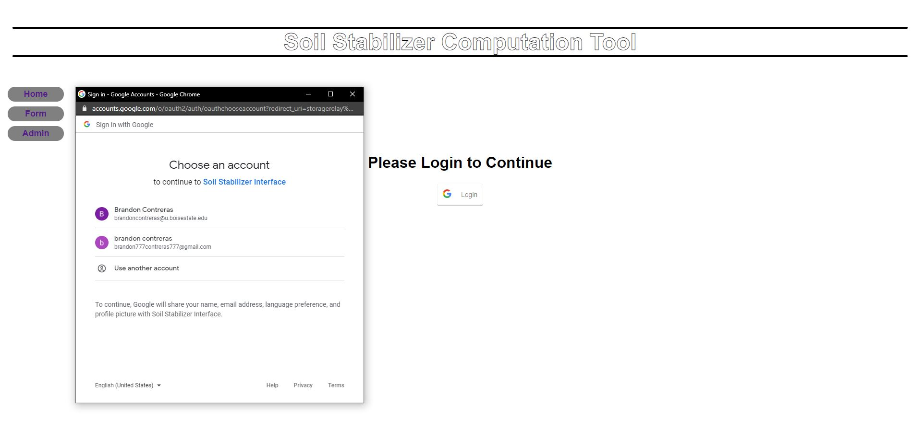
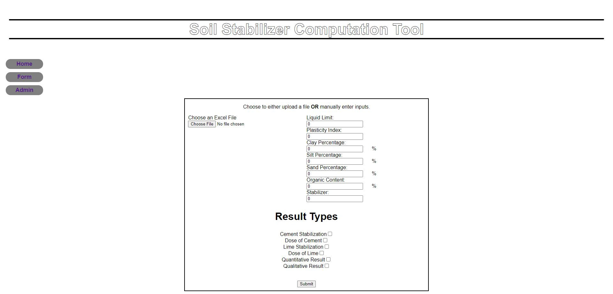
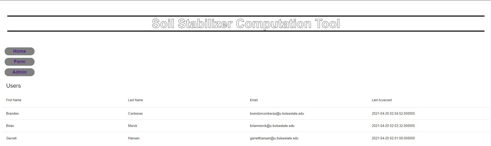

# Web Interface for predicted Soil Strength

## Abstract:
This project is a web interface that enables engineers to predict soil strength for given soil samples using different analysis methods. These analysis methods were provided by Dr. Chittoori and his graduate student Amit Gajurel of Boise State’s college of Civil Engineering. The web interface allows engineers to enter either a single soil sample or multiple samples contained in an Excel file. Predicted stabilized soil strength will then be calculated for each sample using four different methods. A PDF file will then be generated outlining the parameters of each soil sample input and it’s respective prediction values for the four different methods. 

Engineers will be able to easily analyze their soil samples from the field without needing the time or knowledge to use R-Studio to manually evaluate their samples. They will be able to simply upload an Excel file to instantly get four different measurements.

In addition, site owners will be able to track site user behavior. Google sign-in is used to track user sessions. This data is then stored for querying later.

## Project Description:
The website utilizes form-based input from a user’s uploadable Excel file that includes the data that our algorithms process. The input data is then used in our algorithms to calculate values the user can use in their research, and is available for them to download as a PDF.

Site administrators are able to see who has logged in to the site and how many sessions they have logged.

*Google Sign-in*

*File Input*

*User Tracking*

## Members:
 - Garrett Hansen
 - Jonathan Demaree
 - Brandon Contreras
 - Brian Morck

